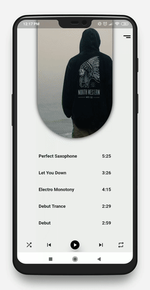

# Flutter Music App

[](https://nodesource.com/products/nsolid)


Music app is a cloud-enabled, mobile-ready powered flutter application.
# Features!
  - Play audios from Playlist
  - Pause, Next and Previous options
  - Shuffle songs
  - Drag play time
  - Global play module (Song will play from any screen)

### Application Behaviour


### Tech

Music app uses a number of open source projects to work properly:

* [Flutter] - Mobile application development framework using Dart!
* [Visual Studio Code] - awesome text editor


### Installation

Music App requires [Flutter](https://flutter.dev/) v1.0.0+ to run.

Install the dependencies and devDependencies.

```sh
$ flutter packages get
```

Start application...

```sh
$ flutter run
```

### Design Credit

Thanks to codestudio_cs
| Design | README |
| ------ | ------ |
| Instagram | https://www.instagram.com/p/Byv6B78AdU8/?igshid=np0orce540uf |

### Contact us
We are working on flutter application
| Email | bhavin@saeculumsolutions.com |
| ------ | ------ |

### Development

Will work on new updates for complete application.

### Todos

 - Work on multiple playlist
 - Performance improvement

### License
----

MIT


